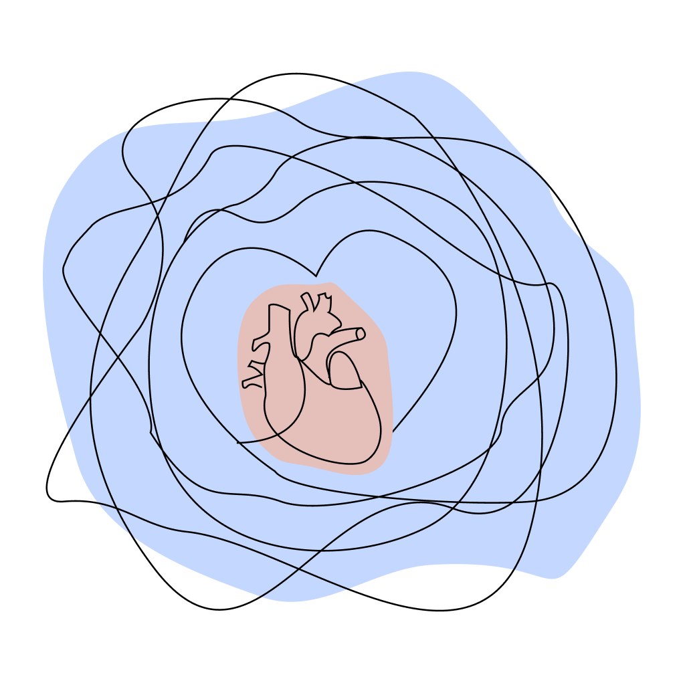
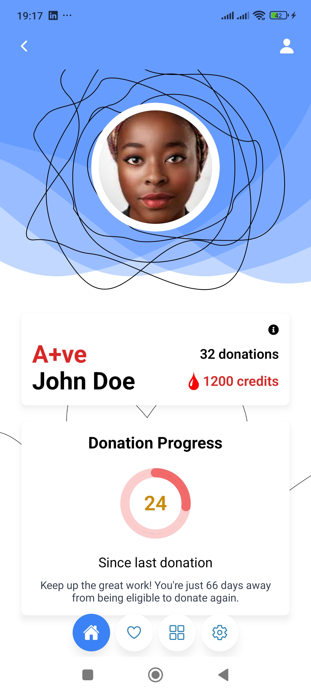
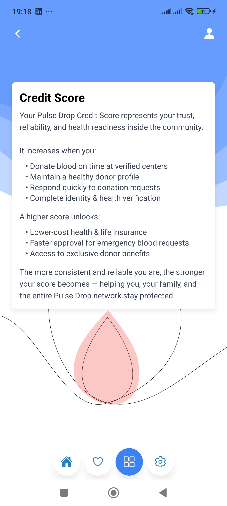
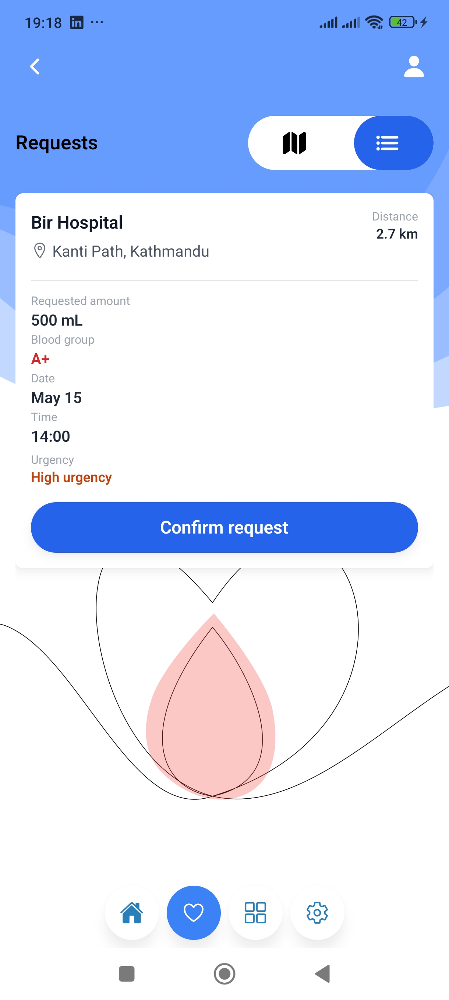
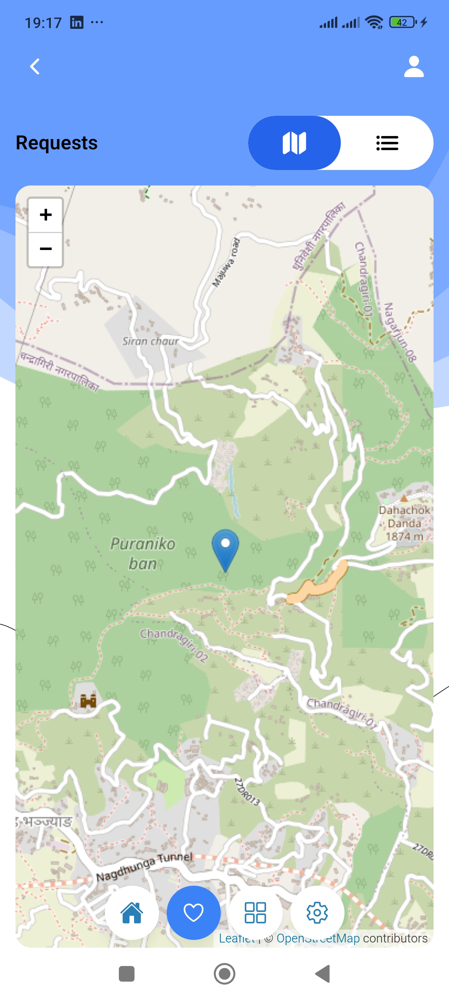
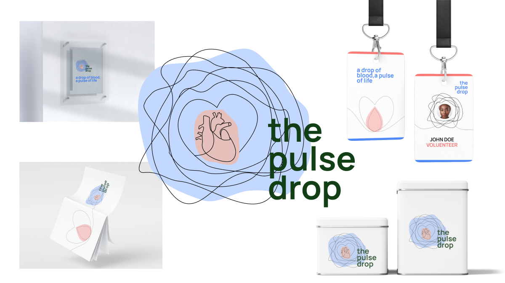

<div align="center">

# 🩸 **the-pulse-drop**  
### _a drop of blood, a pulse of life_



</div>

---

## 📢 About the Project

**the-pulse-drop** is an open-source initiative building a trusted, privacy-first, verified platform to connect **blood donors** with people in urgent need — responsibly and safely.

Even today, people still rely on:

- Random social media posts  
- Personal networks  
- Luck

There is no unified system with:

- Verified requests  
- Trusted hospitals  
- Location-intelligent donor alerts  
- Privacy protection  
- Donor credit scoring  
- CSR-backed incentives  

**We want to fix that.**

---

## 🧩 What We Are Building

### ✔ Verified Requests  
Every request is backed with doctor-signed documents, hospital confirmation, and identity verification.

### ✔ Smart Donor Matching  
Radius expands automatically:  
**5km → 10km → 15km → 20km → 30km**

### ✔ Privacy by Design  
Donor contact details are shared **only after the donor accepts the request**.

### ✔ Donor Credit Score  
Increases when donors:  
- Donate on time  
- Maintain a healthy profile  
- Respond quickly  
- Complete identity & health checks  

Unlocks:  
- Insurance benefits  
- Health discounts  
- Priority approvals  

### ✔ CSR & Health Rewards  
Companies can offer:  
- Pharmacy discounts  
- Checkups  
- Health coupons  
- Insurance perks  

### ✔ Donor Community  
Leaderboards, volunteer IDs, city groups, milestones.

---

## 📱 UI Screens (Current App Progress)

<div style="display:flex; flex-wrap:wrap; justify-content:center; gap:20px;">






</div>

---

## 🧵 Logo & App Assets

### 📣 Social Poster  


### Requirement Drive 
- [App Feature Requirements](https://drive.google.com/drive/folders/1opCXbAt3_jfo26WhknOuKrFPcu3oWQdg?usp=sharing)

### Figma Link
- [UI Design Files](https://www.figma.com/design/cZ29kFWCPbGandNnNtZyi6/Desings?node-id=0-1&t=J54LKXVjGGszlq0J-1)
---

## 💬 Community & Discussion

We build this project **in the open**.  
Join the conversation:
- GitHub Discussions — /discussions  

Everyone is welcome — beginners, doctors, engineers, designers.

---

## 🛠 Tech Stack

### Mobile App
- React Native (Expo)  
- TypeScript  
- NativeWind (Tailwind)  
- Expo Router  
- FCM Notifications  

### Backend (Planned)
- Node.js / Express  
- PostgreSQL / Supabase  
- Redis  
- Cloud Storage (Supabase/S3)

### Services
- Mapbox / Google Maps  
- Geolocation matching algorithms  

---

## 🧭 Roadmap (Open for Contributors)

- [ ] All core UI screens  
- [ ] Document upload workflow  
- [ ] Donor match radius algorithm  
- [ ] Credit score backend  
- [ ] KYC & health verification  
- [ ] CSR partner dashboard  
- [ ] Admin & hospital panel  
- [ ] Leaderboard + social layer  
- [ ] Health marketplace  

If you want to take over a module — open an issue and we’ll collaborate.

---

## 🤝 How to Contribute

We need contributors in:

- React Native  
- UX/UI  
- Backend  
- Cloud  
- Medical workflow  
- CSR partnerships  
- Documentation  

### Steps

1. **Fork** the repository  
2. Create a feature branch  
   ```bash
   git checkout -b feature/your-feature
   ```
4. Push & open a Pull Request
We review PRs quickly.

## 👥 Contributors

| Name | Role |
|------|------|
| **Nirjal Bhurtel** | Founder, Designer, Developer |
| **You?** | Add yourself via your first PR |

---

## 📄 License

MIT License — Free to use, modify, and distribute with attribution.

---

## ⭐ Support the Mission

If you believe in this:

- ⭐ Star this repository  
- 🩸 Contribute a feature  
- 🔗 Share with friends  
- 💬 Join the community  
- ❤️ Help us build a system that saves lives  

<div align="center">
  
</div>

